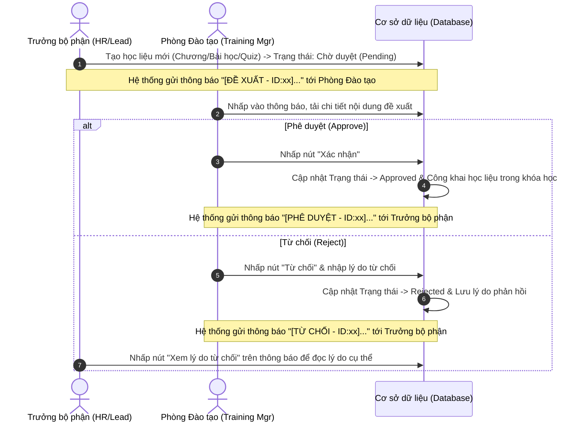
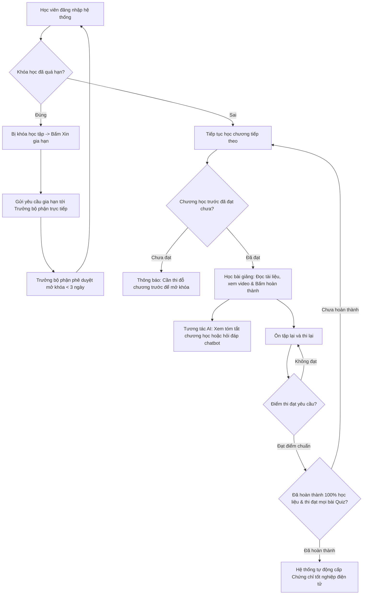

# TÀI LIỆU LUỒNG HOẠT ĐỘNG & PHÂN QUYỀN HỆ THỐNG (LMS)

Tài liệu này mô tả chi tiết cách hệ thống phân chia quyền hạn (Decentralization/Authorization), luồng hoạt động chính của hệ thống và chức năng cụ thể của từng vai trò: **Admin (IT)**, **HR (Trưởng bộ phận)**, **Phòng Đào tạo (Trưởng phòng Đào tạo)**, và **Học viên (Student)**.

---

## 1. PHÂN QUYỀN TRONG HỆ THỐNG (AUTHORIZATION & ROLES)

Hệ thống phân quyền dựa trên sự kết hợp giữa **Vai trò (Role)** của tài khoản và **Phòng ban (Department)** mà tài khoản đó trực thuộc:

| Vai trò (Role) | Phòng ban (Department) | Tên Chức vụ thực tế | Phạm vi ảnh hưởng |
| :--- | :--- | :--- | :--- |
| **IT** | Phòng Công nghệ thông tin | **System Admin (IT)** | Toàn hệ thống (Hệ thống, Dữ liệu, Tài khoản) |
| **Manager** | Trung tâm Đào tạo Nội bộ | **Trưởng phòng Đào tạo** | Toàn bộ khóa học, chương trình đào tạo chung |
| **Manager** | Các phòng ban khác (HR, Kỹ thuật, Sale...) | **HR / Trưởng bộ phận** | Chỉ quản lý nhân sự & khóa học thuộc phòng ban mình |
| **Student** | Tất cả các phòng ban | **Học viên (Student)** | Chỉ thực hiện các hoạt động học tập cá nhân |

---

## 2. CHỨC NĂNG & LUỒNG HOẠT ĐỘNG CỦA TỪNG CHỨC VỤ

### 2.1. System Admin (IT)
*Admin là người vận hành kỹ thuật của hệ thống, không tham gia trực tiếp vào việc giảng dạy hay phê duyệt nội dung chuyên môn.*
*   **Tài khoản Demo:** `admin` (Mật khẩu: `123456`)
*   **Các nhiệm vụ chính:**
    1.  **Quản lý Tài khoản (User Management):** Tạo mới, chỉnh sửa thông tin, đặt lại mật khẩu, mở/khóa tài khoản nhân viên. Phân vai trò rõ ràng cho nhân sự (Student, Manager, IT).
    2.  **Quản lý Phòng ban (Department Management):** Thiết lập cơ cấu tổ chức sơ đồ cây của công ty, chỉ định ai làm Trưởng bộ phận (Manager) của phòng ban đó.
    3.  **Sao lưu và Phục hồi Dữ liệu (Backup & Restore):** Thực hiện sao lưu dữ liệu hệ thống ra file `.sql` để tránh mất mát thông tin và có thể phục hồi khi gặp sự cố.
    4.  **Giám sát Hệ thống (Audit Logs):** Theo dõi lịch sử hoạt động chi tiết (ai đã đăng nhập, ai đã cập nhật/xóa tài liệu hoặc khóa học) để bảo đảm tính an toàn thông tin.

---

### 2.2. HR / Trưởng Bộ Phận Chuyên Môn (Manager)
*Là người quản lý trực tiếp nhân viên thuộc phòng ban của mình, chịu trách nhiệm nâng cao năng lực chuyên môn cho nhân viên.*
*   **Tài khoản Demo:** `maypvkt0001` (Trưởng phòng Kỹ thuật - Phạm Văn Máy)
*   **Các nhiệm vụ chính:**
    1.  **Xây dựng và Đề xuất Học liệu:**
        *   Tạo các chương học, bài học (tài liệu, video) hoặc bài thi trắc nghiệm (Quiz) chuyên môn dành cho phòng ban của mình.
        *   Các tài liệu tạo mới sẽ ở trạng thái **Chờ duyệt (Pending)**. Trưởng phòng bộ phận phải gửi đề xuất lên Phòng Đào tạo.
    2.  **Theo dõi Tiến trình học tập:** Xem danh sách nhân viên cấp dưới, tỷ lệ hoàn thành các khóa học được giao và kết quả làm bài thi trắc nghiệm (đạt/không đạt).
    3.  **Giao khóa học:** Phân công các khóa học (bắt buộc hoặc tự chọn) cho nhân viên thuộc phòng ban mình và thiết lập hạn hoàn thành (DueDate).
    4.  **Duyệt gia hạn học tập:** Khi nhân viên bị quá hạn khóa học và gửi yêu cầu xin gia hạn, Trưởng bộ phận sẽ nhận được thông báo để xem xét phê duyệt gia hạn thêm thời gian học (tối đa 3 ngày).

---

### 2.3. Phòng Đào Tạo (Training Center Manager - Manager)
*Là đơn vị kiểm soát chất lượng đào tạo toàn công ty, phê duyệt nội dung học liệu và thiết lập các khóa học dùng chung.*
*   **Tài khoản Demo:** `lanhhgv0001` (Trưởng phòng Đào tạo - Hoàng Hương Lan)
*   **Các nhiệm vụ chính:**
    1.  **Phê duyệt Đề xuất Học liệu (Chức năng cốt lõi):**
        *   Nhận thông báo khi có các Trưởng bộ phận khác gửi đề xuất (thêm Chương mới, Bài học mới, Quiz mới).
        *   Xem chi tiết nội dung đề xuất.
        *   **Xác nhận (Approve):** Đồng ý phê duyệt. Học liệu sẽ chính thức hiển thị vào khóa học cho học viên học tập.
        *   **Từ chối (Reject):** Không đồng ý phê duyệt, bắt buộc nhập rõ lý do từ chối (ví dụ: tài liệu sơ sài, thiếu video minh họa...).
    2.  **Quản lý Khóa học dùng chung:**
        *   Xây dựng các khóa học định hướng, quy chế, an toàn lao động... dùng chung cho toàn bộ nhân sự công ty.
        *   Phân bố ngân sách đào tạo và chỉ định các phòng ban bắt buộc phải tham gia học tập.

---

### 2.4. Học Viên (Student)
*Là nhân viên tham gia các chương trình đào tạo để tích lũy kiến thức và hoàn thành các chứng chỉ bắt buộc.*
*   **Tài khoản Demo:** `cuongnvcn0001` (Nguyễn Văn Cường)
*   **Các nhiệm vụ chính:**
    1.  **Học tập chủ động & tuần tự:**
        *   Truy cập các khóa học được giao hoặc khóa học tự chọn.
        *   Đọc tài liệu, xem video bài giảng. Nhấn "Hoàn thành bài học" để tích lũy phần trăm tiến độ.
        *   Tuân thủ quy trình ràng buộc: Phải học xong chương trước và thi đạt điểm chuẩn bài Quiz mới được mở khóa học chương tiếp theo.
    2.  **Tương tác với Trợ lý AI (Gemini):**
        *   Bấm nút **✨ AI** cạnh chương học để AI tự động tóm tắt nhanh nội dung chính của chương.
        *   Chat trực tiếp với **Trợ lý AI** ở góc phải màn hình để giải thích các thuật ngữ khó hoặc đặt câu hỏi mở rộng liên quan đến bài học.
    3.  **Làm bài kiểm tra (Quiz) & Nhận Chứng chỉ:**
        *   Làm bài thi trắc nghiệm ở cuối mỗi chương. Nếu điểm số đạt mức quy định, hệ thống ghi nhận đạt.
        *   Khi hoàn thành 100% tiến độ học tập và vượt qua tất cả các bài kiểm tra, hệ thống tự động cấp **Chứng chỉ hoàn thành** dạng số, cho phép học viên tải về thiết bị.
    4.  **Xin gia hạn học tập:**
        *   Nếu khóa học bị quá hạn (DueDate), hệ thống sẽ khóa chức năng học tập.
        *   Học viên gửi yêu cầu **Xin gia hạn** giải trình lý do trực tiếp lên Trưởng phòng bộ phận của mình để được mở khóa học tiếp.

---

## 3. LUỒNG HOẠT ĐỘNG CHÍNH CỦA HỆ THỐNG (CORE WORKFLOWS)

### 3.1. Luồng Đề xuất và Phê duyệt học liệu (Chương/Bài học/Quiz)

---

### 3.2. Luồng Học tập, Thi cử & Cấp Chứng chỉ của Học viên

